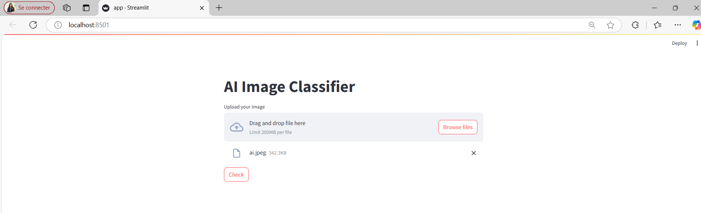
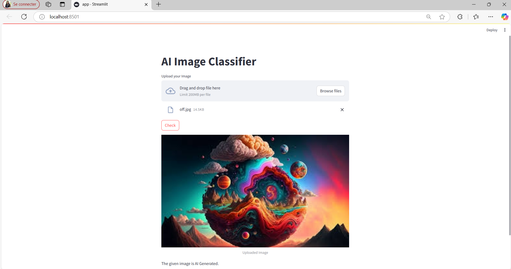
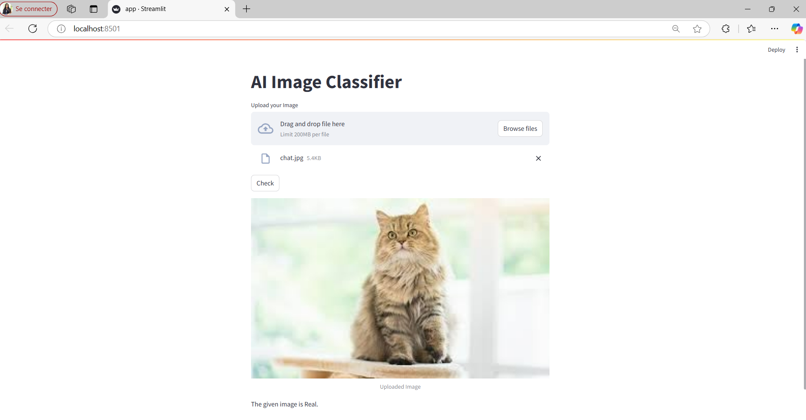

# Real_AI_Generated_Image_Classification

Presented By : Malek Elmechi & Fatma Krichen

# Table of Contents

- Project Overview

- Features

- Model Training

- Running the Streamlit App

- Technologies Used

- Results

# Project Overview

This project is built using PyTorch and Streamlit. The model leverages a pre-trained ResNet-50 architecture, fine-tuned to classify images into "REAL" or "FAKE" categories. Training was conducted on Google Colab, and the trained model can be downloaded and deployed locally for testing and web-based predictions.

# Features

1- Fine-tuned ResNet-50 model to distinguish between real and AI-generated images

2- Streamlit web app for easy image upload and classification

3- Real-time feedback on uploaded images

# Model Training

If you want to retrain the model, you can use the provided train_model.ipynb script on Google Colab or locally if you have a compatible GPU setup.

* Training Steps:

1- Prepare your dataset and directory structure as follows:

dataset/

├── train/

│   ├── REAL/

│   └── FAKE/

└── test/

│   ├── REAL/

│    └── FAKE/

2- Follow the steps in the train_model.ipynb to train the model and save the final weights as model.pth.

# Running the Streamlit App

To run the web application:

1- Start the Streamlit server      :  streamlit run test_model.py

2- Open the displayed local URL in your web browser.

3- Use the test_model.ipynb to load the model and make predictions on new images.

4- Upload an image in the Streamlit app to receive a classification result of "REAL" or "AI generated"

# Technologies Used

- Python
- PyTorch - Deep learning framework
- Torchvision - Pre-trained models and image transformations
- Streamlit - Web application framework for machine learning models

# Results 

